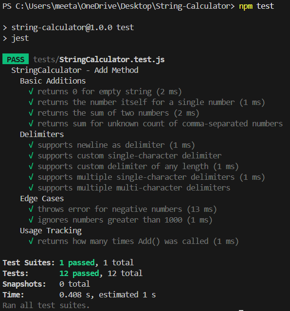

# 🧮 String Calculator - TDD Kata (JavaScript)

A fully test-driven implementation of the classic **String Calculator** problem using **JavaScript** and **Jest**.  
This project demonstrates clean code practices, incremental development, and strict TDD methodology.  
Developed as part of the **Incubyte Recruitment Assessment**.

## 🛠 Tech Stack

- **JavaScript** – Used for implementing the String Calculator logic  
- **Jest** – Used for writing and running unit tests using the TDD approach

## ✅ Test Cases Covered

| #   | Input String                        | Expected Output | Description                                      |
|-----|-------------------------------------|------------------|--------------------------------------------------|
| 1   | `""`                                | `0`              | Returns 0 for empty string                       |
| 2   | `"5"`                               | `5`              | Returns number itself when one number is given   |
| 3   | `"3,7"`                              | `10`             | Returns sum of two comma-separated numbers       |
| 4   | `"1,2,3,4,5"`                        | `15`             | Handles unknown count of comma-separated numbers |
| 5   | `"1\n2,3"`                           | `6`              | Supports newline as delimiter                    |
| 6   | `"//;\n1;2"`                         | `3`              | Supports custom single-character delimiter       |
| 7   | `"1,-2"`                             | ❌ Error         | Throws error for negative numbers                |
| 8   | `"2,1001,6"`                         | `8`              | Ignores numbers greater than 1000                |
| 9   | `"//[***]\n1***2***3"`               | `6`              | Supports delimiter of any length                 |
| 10  | `"//[*][%]\n1*2%3"`                 | `6`              | Supports multiple single-character delimiters    |
| 11  | `"//[**][%%]\n1**2%%3"`             | `6`              | Supports multiple delimiters with length > 1     |
| 12  | N/A                                  | `2`              | Tracks how many times `Add()` was invoked        |

---
